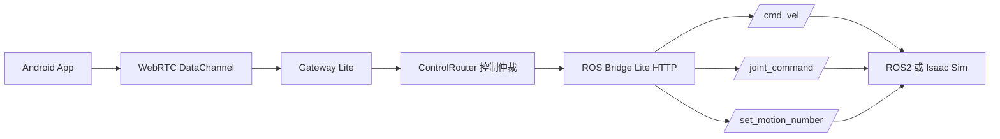
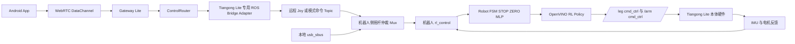

# 天工 Lite 摇杆步态控制方案评估

## 1. 结论摘要

### 总结结论

针对天工 Lite，当前 `SynEIAgent` 这套链路适合作为：

- 远程交互入口
- WebRTC 控制与视频链路
- 仿真验证桥接层
- 语音/摇杆仲裁层

但它**还不能直接作为真机可上线的人形步态控制器**。

核心原因很明确：

- `SynEIAgent` 当前控制链路最终落点是 `/cmd_vel` 或轻量级 `/joint_command`
- 天工参考项目 `Deploy_Tienkung` 的最终落点是机器人本体侧 RL 控制器，它会本地完成：
  - `STOP / ZERO / MLP` 状态机
  - IMU/电机反馈闭环
  - OpenVINO 策略推理
  - 最终电机控制指令发布

也就是说：

- `SynEIAgent` 现在更像“外层遥控壳”
- 天工参考项目才是“内层步态控制核心”

### 推荐路线

建议保留 `SynEIAgent` 的这些部分：

- Android App 摇杆与语音交互
- WebRTC / DataChannel 传输
- Gateway 控制状态机
- 语音与摇杆优先级仲裁
- 健康检查与状态观测

不建议把下面这两部分当成天工 Lite 真机最终步态方案：

- `ros_bridge_lite` 里的 `joint_gait`
- `TGrobot4s/isaac_sim/ros2_control_bridge.py`

推荐的最终生产方案是：

1. `App -> Gateway` 保持不变
2. `Gateway -> ROS Bridge` 继续作为高层适配边界
3. 增加一个 `天工 Lite 专用适配模式`
4. 真机侧复用天工已有的 `rl_control / usb_sbus / RL gait` 控制栈
5. 让机器人本体继续负责真正的步态状态机、策略推理与电机输出

一句话总结：

- 仿真链路：继续使用当前 `cmd_vel / joint_gait`
- 真机链路：切换为“远程摇杆输入 + 天工机器人侧 RL 控制栈”

---

## 2. 当前实现现状

## 2.1 SynEIAgent 当前控制链路

当前 `SynEIAgent` 的主控制链路可以概括为：

当前方案的关键特征：

- 移动端以约 `50ms` 一次的节拍发送控制命令
- `Gateway Lite` 有一套本地控制状态机：
  - `IDLE`
  - `JOYSTICK_ACTIVE`
  - `VOICE_ACTION`
  - `EMERGENCY_STOP`
- `Gateway Lite` 已具备：
  - `seq` 去重
  - 摇杆限频
  - deadman 自动停
  - 语音/摇杆仲裁
  - 急停锁存
- `ros_bridge_lite` 当前支持两种输出模式：
  - `cmd_vel`
  - `joint_gait`

当前代码里已经明确说明：

- `joint_gait` 是一个**轻量级、用于桥接联调/仿真验证**的步态生成器
- 它不是 `rl_control_new` 那种真正的人形 RL 步态控制器替代品

对应代码依据：

- [README.md](D:/Develop/Project/SynEIAgent/README.md)
- [state.py](D:/Develop/Project/SynEIAgent/gateway_lite/state.py)
- [safety.py](D:/Develop/Project/SynEIAgent/gateway_lite/safety.py)
- [main.py](D:/Develop/Project/SynEIAgent/ros_bridge_lite/main.py)
- [gait_controller.py](D:/Develop/Project/SynEIAgent/ros_bridge_lite/gait_controller.py)
- [TeleopCoordinator.kt](D:/Develop/Project/SynEIAgent/TGrobot4s/mobile/app/src/main/java/com/tgrobot/mobile/feature/control/TeleopCoordinator.kt)
- [ros2_control_bridge.py](D:/Develop/Project/SynEIAgent/TGrobot4s/isaac_sim/ros2_control_bridge.py)

## 2.2 天工参考项目控制链路

`Deploy_Tienkung` 的核心链路如下：

其关键特征：

- 本地主控制循环频率约为 `400Hz`，配置中 `dt = 0.0025`
- 输入是“摇杆语义”而不是移动端直接下发关节轨迹
- 机器人本体侧完成：
  - `STOP -> ZERO -> MLP` 状态切换
  - IMU 和关节状态反馈处理
  - 20 关节输出目标计算
  - 最终的 `bodyctrl_msgs` 电机控制发布
- 策略推理采用 OpenVINO
- 观测历史维度固定为 `750`

关键事实：

- 摇杆输入订阅的是 `/sbus_data`
- 最终控制输出是 `/leg/cmd_ctrl` 和 `/arm/cmd_ctrl`
- 机器人真正“走起来”的逻辑发生在本体 RL 控制器里，不在外部桥里

对应代码依据：

- [RLControlNewPlugin.cpp](D:/Develop/tgrobot/Deploy_Tienkung/rl_control_new/src/plugins/rl_control_new/src/RLControlNewPlugin.cpp)
- [FSMStateImpl.cpp](D:/Develop/tgrobot/Deploy_Tienkung/x_humanoid_rl_sdk/src/robot_FSM/FSMStateImpl.cpp)
- [tg22_config.yaml](D:/Develop/tgrobot/Deploy_Tienkung/rl_control_new/config/tg22_config.yaml)

---

## 3. 当前打算与参考方案的差异

| 维度 | SynEIAgent 当前方案 | 天工参考 RL 方案 | 差异影响 |
| --- | --- | --- | --- |
| 控制抽象层 | `joystick -> gateway -> /cmd_vel` 或 `/joint_command` | `joystick -> robot FSM -> RL policy -> motor command` | 当前链路停在过高层，真机步态核心没有接上 |
| 步态生成方式 | 6 关节简化 gait 生成器 | 20 关节 RL 步态策略 | 当前 `joint_gait` 不足以作为天工 Lite 真机走路方案 |
| 反馈闭环 | 主要是外部桥接逻辑，接近开环 | IMU + 电机状态闭环 | 当前方案缺少真实稳定控制闭环 |
| 状态机归属 | Gateway 负责交互控制状态 | 机器人本体负责 `STOP/ZERO/MLP` | 最终必须增加机器人侧模式控制与反馈 |
| 输出接口 | `/cmd_vel`、`/joint_command`、`/set_motion_number` | `/sbus_data` 输入，`/leg/arm cmd_ctrl` 输出 | 接口不一致，是最大集成差异 |
| 控制频率 | App 20Hz 左右，Bridge 50Hz | 本体本地 400Hz 左右 | 当前频率适合高层遥控，不适合直接做电机级控制 |
| 安全边界 | Gateway deadman/仲裁 | 本体 gait controller + actuator 本地安全 | 如果真机还停在 bridge 层，安全边界不完整 |
| 运行环境 | Windows/Python/HTTP/Isaac 验证友好 | Ubuntu/ROS2/OpenVINO/C++ 机器人本体运行时 | 真机最终必须落到机器人 ROS2 环境 |
| 语音动作接入 | `/motion` 路由已存在 | 参考方案以摇杆/FSM 为主 | 需要额外处理动作与步态互斥关系 |

### 实际含义

当前方案不是方向错了，而是**只做到了外层控制壳**，还没有真正接入天工 Lite 的内层步态控制核心。

你们现在已经有：

- 远程控制入口
- 交互状态管理
- 仿真验证桥
- 语音/摇杆统一调度

你们还缺的是：

- 天工 Lite 专用控制适配层
- 机器人本体侧模式切换握手
- 对现有 `rl_control` 栈的复用接入

---

## 4. 推荐的最终业务链路

## 4.1 推荐生产链路架构

## 4.2 责任边界建议

### `SynEIAgent` 负责

- App 遥控交互
- 网络传输
- 远程指令组织
- 摇杆/语音仲裁
- deadman、限频、seq 去重
- 状态上报和观测

### 天工 Lite 本体控制栈负责

- 真正的步态状态机
- 平衡与闭环反馈
- RL 策略推理
- 关节目标计算
- 最终电机控制下发

这个边界是最合理的：

- 外部系统不要代替人形本体步态核心
- 机器人本体保留“最后控制权”

## 4.3 建议保留的两种运行模式

### 模式 A：仿真验证模式

用途：

- Isaac Sim 联调
- UI/控制链路验证
- 语音/摇杆交互验证

链路：

- `Gateway -> ros_bridge_lite(control_mode=cmd_vel 或 joint_gait) -> Isaac Sim`

### 模式 B：真机生产模式

用途：

- 天工 Lite 真机摇杆步态控制

链路：

- `Gateway -> ros_bridge_lite(control_mode=tienkung_remote_joy) -> 远程摇杆 Topic -> rl_control`

也就是说：

- 当前 `joint_gait` 保留，但只用于仿真和联调
- 真机必须新增 `tienkung_remote_joy` 或同类适配模式

## 4.4 推荐的接口方案

### 新增生产模式

建议在 `ros_bridge_lite` 增加：

- `control_mode=tienkung_remote_joy`

该模式不要再输出简化 gait 关节轨迹，而是输出：

- `sensor_msgs/Joy` 兼容远程摇杆消息
- 或者一个天工自定义远程 teleop topic
- 可选一个显式模式控制 topic，例如 `/teleop/mode_cmd`

### 推荐映射关系

- 移动端摇杆 `linear/angular` -> 天工摇杆轴值
- “开始走路” -> 先 `gotoZero` 再 `gotoMLP`
- “急停” -> `gotoStop`
- “语音动作” -> `/set_motion_number`

注意：

- `/set_motion_number` 应该和 walking 状态互锁
- walking 时不要允许任意动作直接打断步态

### 推荐机器人侧仲裁 Mux

不要直接把远程控制覆盖本地手柄。

推荐机器人侧设计：

- 本地硬件手柄输入：`/sbus_data_hw`
- 远程摇杆输入：`/sbus_data_remote`
- 仲裁输出：`/sbus_data`

推荐优先级：

1. 本地急停
2. 本地硬件摇杆
3. 远程摇杆
4. 语音动作触发

### 推荐状态反馈

建议机器人侧增加状态反馈 Topic 或 Service，让 Gateway/App 能知道：

- 当前 gait 状态是不是 `STOP / ZERO / MLP`
- `ZERO` 是否完成
- 急停是否锁存
- 当前是否允许进入 walking
- 是否有 IMU / 电机故障

没有这层反馈时，Gateway 只能知道：

- “HTTP 请求发出去了”

而不知道：

- “机器人是否真的进入了 walking”

---

## 5. 风险与漏洞评估

## 5.1 P0 风险：真机上线前必须解决

### P0-1. 当前 `joint_gait` 不能作为天工 Lite 真机最终步态控制器

当前 `joint_gait` 的问题：

- 只控制 6 个关节
- 基本是开环步态生成
- 没有 IMU 平衡控制
- 没有天工专用 RL 策略
- 没有全身协调控制

这类方案适合：

- 仿真验证
- UI 联调
- 控制闭环打通

不适合：

- 直接驱动天工 Lite 真机稳定步行

如果直接用于真机，风险很高：

- 走路不稳
- 收敛差
- 姿态不正确
- 容易出现不可预期动作

### P0-2. 当前接口和天工 RL 控制栈不一致

目前桥输出的是：

- `/cmd_vel`
- `/joint_command`
- `/set_motion_number`

而参考方案真正吃的是：

- `/sbus_data` 摇杆语义
- 机器人本体状态机输入
- 本体 IMU/电机反馈闭环

如果不解决这一层接口差异，会出现：

- 控制链路表面通了，但机器人不走
- 两套控制器互相抢控制权
- 外层 bridge 绕开了真正的人形步态核心

### P0-3. 目前没有本地与远程摇杆的机器人侧仲裁

`SynEIAgent` 目前主要在 Gateway 这一侧做逻辑仲裁。

但真机运行时必须解决：

- 本地硬件手柄
- 远程 App 摇杆
- 急停
- 语音动作

在机器人侧如何统一仲裁。

否则可能出现：

- 本地和远程命令冲突
- 急停优先级不清
- 远程错误覆盖本地控制

### P0-4. 缺少真实 gait 状态握手反馈

现在 Gateway 能知道的是：

- 指令有没有送到 bridge

但不知道：

- 机器人是否进入了 `ZERO`
- `ZERO` 是否完成
- 是否成功进入 `MLP`
- 是否因为故障拒绝 walking

这属于非常重要的“业务盲区”。

### P0-5. 参考实现本身也有安全收口不足

从 `Deploy_Tienkung` 公开代码来看，存在一些需要注意的点：

- IMU 超限虽然检测了，但公开代码中没有看到强制切换到安全状态的完整闭环
- `RobotInterface` 在公开代码里接近空壳
- 配置和启动路径有一定硬编码痕迹

这不代表参考方案不能用。
它代表的是：

- 可以借鉴结构
- 但不能不加改造直接按演示代码上线真机

### P0-6. 网络控制面还没有做到生产级安全

当前 Gateway/Bridge 架构适合开发联调，但生产还需要：

- 控制会话鉴权
- 更严格的网络暴露策略
- 命令来源审计
- 机器人侧最终安全兜底

否则远控接口本身就会变成风险面。

## 5.2 P1 风险：集成阶段应该解决

### P1-1. 语音动作和步态存在冲突风险

当前 Gateway 已经做了一部分语音与摇杆互斥，这是好的。

但最终真机还需要机器人侧明确规则，例如：

- walking 中禁止某些动作
- 某些动作前必须先 `STOP` 或 `ZERO`
- 远程摇杆控制生效时，语音动作不能直接抢占

### P1-2. “有订阅者”不等于“动作执行成功”

现在 Bridge 能检查 Topic 是否有订阅者，这是有帮助的。

但生产上仍不够，因为：

- 有订阅者不等于真正执行了
- 执行了不等于进入了目标 gait 状态
- 进入了 gait 状态也不等于稳定运行

所以最终必须补：

- 执行确认
- 状态回传
- 故障回传

### P1-3. 多运行环境导致部署复杂度高

当前体系跨越：

- Android App
- Gateway Python 运行时
- ROS Bridge Python 运行时
- Isaac Sim 或机器人侧 ROS2 运行时
- 天工 RL/OpenVINO 运行时

架构上这是合理的，但带来：

- 部署复杂度上升
- 环境版本耦合
- 联调问题定位成本变高

### P1-4. 你们本地已有机器人工作区，但实际话题/包名还需核验

从仓库里已经能看到这些安装产物：

- `TGrobot4s/robot/ros2ws/ros2ws/install/rl_control`
- `TGrobot4s/robot/ros2ws/ros2ws/install/usb_sbus`
- `TGrobot4s/robot/ros2ws/ros2ws/install/hric_msgs`

这说明：

- 你们本地已经具备接入天工控制链的基础环境

但也意味着：

- 最终要以你们实际机器人工作区的话题、launch、service 为准
- 不能只照搬 `Deploy_Tienkung` 公开仓里的命名

## 5.3 P2 风险：维护性与技术债

### P2-1. 仿真步态和真机步态可能长期分叉

如果 `joint_gait` 后面持续增强，团队可能会同时维护两套步态系统：

- Python 仿真 gait
- 机器人侧 RL gait

这会带来：

- 维护成本高
- 语义不一致
- 仿真与真机行为逐渐偏离

建议：

- 明确 `joint_gait` 只做仿真适配
- 不让它演化成业务主步态核心

### P2-2. 全链路审计能力还不完整

未来如果进入生产，建议能追踪：

- 用户输入
- Gateway 仲裁结果
- Bridge 输出
- 机器人侧状态切换
- 最终执行或故障结果

当前这条链还没有完全闭合。

---

## 6. 可行性评估

## 6.1 作为外层遥控壳的可行性

`SynEIAgent` 作为外层控制壳，**可行性高**。

因为它已经具备：

- App 摇杆与语音入口
- DataChannel 控制链路
- 基础 deadman
- seq 去重
- 语音/摇杆优先级控制
- 健康与状态接口

这部分不需要推翻，值得继续复用。

## 6.2 作为真机最终步态控制器的可行性

如果指的是直接用当前 `joint_gait` 驱动天工 Lite 真机步行，**可行性低**。

原因：

- 它不是天工 Lite 的真实步态核心
- 缺失本体级反馈闭环
- 缺少全身 RL 控制
- 缺少机器人本体模式切换接入

## 6.3 作为“外层控制壳 + 内层天工 RL 步态核心”的方案可行性

如果采用：

- `SynEIAgent` 负责远程交互与控制壳
- 天工 Lite 本体继续跑 `rl_control` / `usb_sbus` / RL gait

那么整体**可行性高，而且是推荐路线**。

这是速度、复用性和安全性之间平衡最好的方案。

---

## 7. 推荐实施方案

## 7.1 方案原则

最终建议是：

- 不替换天工 Lite 现有机器人侧 gait 控制栈
- 只在外部增加一个“远程遥控输入适配层”
- 让 `SynEIAgent` 成为远程交互壳，而不是步态内核

## 7.2 推荐的落地拆分

### 保留

- App 遥控 UI
- WebRTC 控制与视频
- Gateway 控制仲裁
- 仿真桥接

### 需要新增

- `ros_bridge_lite` 新增 `tienkung_remote_joy` 模式
- 机器人侧 `usb_sbus` / 远程摇杆仲裁 Mux
- 机器人侧 gait 状态反馈
- walking 与动作服务互锁逻辑

### 不建议做

- 不建议把当前 6 关节 `joint_gait` 直接拿去做天工 Lite 真机最终步态控制
- 不建议绕开机器人本体 `rl_control` 栈自己重新造一套真机步态核心

---

## 8. 下一步最小可交付项

建议下一阶段先做这 6 项：

1. 在 `ros_bridge_lite` 中增加 `control_mode=tienkung_remote_joy`
2. 输出远程摇杆兼容 Topic，而不是继续输出 `joint_gait`
3. 在机器人侧增加本地/远程摇杆仲裁 Mux
4. 增加 `STOP / ZERO / MLP` 状态反馈接口
5. 对 `/set_motion_number` 增加 walking 状态互锁
6. 保留 `joint_gait` 仅用于 Isaac Sim 和 UI 联调

---

## 9. 最终判断

### 可行性判断

- `SynEIAgent` 作为外层产品控制壳：**高可行**
- 当前 `joint_gait` 直接作为天工 Lite 真机步态控制器：**低可行**
- `SynEIAgent + 天工本体 RL gait 栈复用`：**高可行，且最推荐**

### 最优职责划分

- `SynEIAgent` 负责：远程交互、控制入口、控制仲裁、网络传输、状态观测
- `天工 Lite 本体控制栈` 负责：步态状态机、平衡闭环、策略推理、电机控制

这是当前最合理、最稳妥、工程成本最低的方案。

---

## 10. 参考依据

本次评估主要阅读的文件包括：

- [README.md](D:/Develop/Project/SynEIAgent/README.md)
- [state.py](D:/Develop/Project/SynEIAgent/gateway_lite/state.py)
- [safety.py](D:/Develop/Project/SynEIAgent/gateway_lite/safety.py)
- [server.py](D:/Develop/Project/SynEIAgent/gateway_lite/server.py)
- [ros_client.py](D:/Develop/Project/SynEIAgent/gateway_lite/ros_client.py)
- [main.py](D:/Develop/Project/SynEIAgent/ros_bridge_lite/main.py)
- [gait_controller.py](D:/Develop/Project/SynEIAgent/ros_bridge_lite/gait_controller.py)
- [TeleopCoordinator.kt](D:/Develop/Project/SynEIAgent/TGrobot4s/mobile/app/src/main/java/com/tgrobot/mobile/feature/control/TeleopCoordinator.kt)
- [TeleopViewModel.kt](D:/Develop/Project/SynEIAgent/TGrobot4s/mobile/app/src/main/java/com/tgrobot/mobile/feature/control/TeleopViewModel.kt)
- [ros2_control_bridge.py](D:/Develop/Project/SynEIAgent/TGrobot4s/isaac_sim/ros2_control_bridge.py)
- [rl.py](D:/Develop/Project/SynEIAgent/TGrobot4s/robot/ros2ws/ros2ws/install/rl_control/share/rl_control/launch/rl.py)
- [usb_sbus.launch.py](D:/Develop/Project/SynEIAgent/TGrobot4s/robot/ros2ws/ros2ws/install/usb_sbus/share/usb_sbus/launch/usb_sbus.launch.py)
- [RLControlNewPlugin.cpp](D:/Develop/tgrobot/Deploy_Tienkung/rl_control_new/src/plugins/rl_control_new/src/RLControlNewPlugin.cpp)
- [FSMStateImpl.cpp](D:/Develop/tgrobot/Deploy_Tienkung/x_humanoid_rl_sdk/src/robot_FSM/FSMStateImpl.cpp)
- [tg22_config.yaml](D:/Develop/tgrobot/Deploy_Tienkung/rl_control_new/config/tg22_config.yaml)
